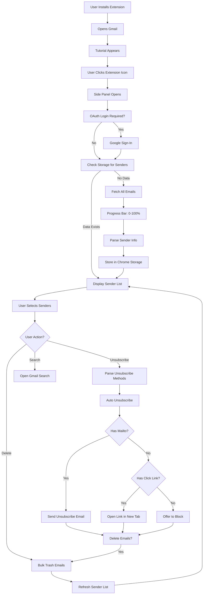

<div align="center">
  
  
  # Mailzap
  
  ### *Declutter Your Gmail in Seconds*
  
  [](https://chrome.google.com/webstore)
  [](https://www.typescriptlang.org/)
  [](https://react.dev/)
  [](LICENSE)

  **A powerful Chrome extension that helps you take back control of your inbox through intelligent sender analysis and bulk email management.**

  [Features](#-features) • [Tech Stack](#-technology-stack) • [How It Works](#-how-it-works) • [Installation](#-installation) • [Architecture](#-system-design--architecture)

  ---
</div>

## What is Mailzap?

Mailzap is a **Chrome extension** that transforms Gmail inbox management from a tedious manual task into an automated, intelligent process. Built with modern web technologies, it analyzes your entire email history, identifies the biggest contributors to inbox clutter, and provides powerful bulk operations to clean up thousands of emails in just a few clicks.

### The Problem It Solves

- **Email Overload**: Thousands of promotional emails cluttering your inbox
- **⏱Time-Consuming**: Manually unsubscribing from multiple senders takes hours
- **No Visibility**: Hard to identify which senders are the biggest culprits
- **Repetitive Work**: Deleting emails from the same senders over and over

### The Solution

Mailzap provides a **comprehensive dashboard** that:
- Scans your entire Gmail inbox and identifies all unique senders
- Ranks senders by email frequency (who sends you the most emails)
- Enables **bulk selection** of multiple senders at once
- Offers **one-click operations**: Unsubscribe, Delete, Block, or Search
- Automates the unsubscribe process by parsing email headers and bodies
- Runs entirely client-side for **maximum privacy**

---

## Features

<table>
<tr>
<td width="50%">

### Smart Sender Analytics
- Analyzes **all emails** in your inbox
- Identifies **unique senders** with message counts
- **Sorted by frequency** - see who emails you most
- **Real-time progress tracking** during analysis
- **Cached results** for instant subsequent loads

</td>
<td width="50%">

### Intelligent Bulk Operations
- **Select multiple senders** with checkboxes
- **One-click bulk actions** on all selected
- **Preview emails** before taking action
- **Progress indicators** for long operations
- **Confirmation dialogs** to prevent accidents

</td>
</tr>
<tr>
<td width="50%">

### Automated Unsubscribe
- **Parses `List-Unsubscribe` headers** automatically
- **Extracts mailto links** from email bodies
- **Sends unsubscribe emails** via Gmail API
- **Handles click-only links** with manual flow
- **Fallback to blocking** if no unsubscribe found

</td>
<td width="50%">

### Bulk Email Management
- **Delete up to 500 emails** per sender
- **Batch processing** with rate limiting
- **Moves emails to trash** (not permanent delete)
- **Updates storage** to reflect changes
- **Search integration** to preview emails

</td>
</tr>
<tr>
<td width="50%">

### Security & Privacy
- **OAuth 2.0** authentication with Google
- **Minimal Gmail scopes** (only what's needed)
- **No external servers** - all processing local
- **Secure token management** via Chrome APIs
- **HTTPS-only** communication

</td>
<td width="50%">

### Modern UI/UX
- **Chrome Side Panel** integration (Gmail only)
- **Responsive design** with loading states
- **Skeleton screens** during data fetching
- **Interactive tutorial** for first-time users
- **Clean, intuitive interface** built with React

</td>
</tr>
</table>

---

## Technology Stack

### **Frontend Framework**
| Technology | Version | Purpose | Where Used |
|-----------|---------|---------|------------|
| **React** | 19.0.0 | Component-based UI framework with hooks | All UI components (sidebar, popup, tutorial) |
| **TypeScript** | 5.7.2 | Static typing for better code quality | Entire codebase for type safety |
| **CSS3** | - | Styling with custom animations | Component-specific stylesheets |

**Why React?** Enables component reusability, state management through Context API, and efficient re-rendering with hooks.

**Why TypeScript?** Catches errors at compile-time, provides better IDE support, and makes refactoring safer.

---

### **Build Tools & Development**
| Technology | Version | Purpose | Where Used |
|-----------|---------|---------|------------|
| **Vite** | 6.2.0 | Fast build tool with HMR | Development server and production builds |
| **TypeScript Compiler** | 5.7.2 | Transpiles TS to JS | Build process (`tsc -b`) |
| **ESLint** | 9.21.0 | Code linting and quality checks | Enforces coding standards across all `.ts`/`.tsx` files |
| **Prettier** | 3.5.3 | Code formatting | Formats all files consistently |
| **Stylelint** | 16.18.0 | CSS linting | Validates CSS files |

**Why Vite?** Lightning-fast hot module replacement (HMR), optimized production builds, and better developer experience compared to webpack.

**Vite Configuration Highlights:**
- Multi-page setup with separate entry points for sidebar, popup, and tutorial
- Public directory for static assets and manifest
- React plugin for JSX transformation

---

### **Chrome Extension APIs**
| API | Purpose | Where Used |
|-----|---------|------------|
| **chrome.identity** | OAuth 2.0 authentication with Google | `chromeAuth.ts` - Getting/validating tokens |
| **chrome.storage.local** | Local data persistence | Storing sender data, fetch progress, user state |
| **chrome.sidePanel** | Side panel UI on Gmail pages | `background.js` - Enabling panel on Gmail |
| **chrome.tabs** | Tab management and messaging | Content script communication, opening links |
| **chrome.runtime** | Background script lifecycle | Message passing between components |
| **chrome.action** | Extension icon behavior | Popup toggle based on current site |

**Manifest V3 Compliance:**
- Service worker instead of background page
- `host_permissions` replaced with minimal `permissions`
- CSP-compliant script loading

---

### **Gmail API Integration**
| API Endpoint | Purpose | Where Used |
|--------------|---------|------------|
| **`/gmail/v1/users/me/messages`** | Fetch message IDs and metadata | `fetchMessageIds.ts`, `fetchSenders.ts` |
| **`/gmail/v1/users/me/messages/{id}`** | Get specific message details | `fetchSenders.ts` (headers), `unsubscribeSenders.ts` (body) |
| **`/gmail/v1/users/me/messages/{id}/trash`** | Move messages to trash | `trashSenders.ts` |
| **`/gmail/v1/users/me/messages/send`** | Send unsubscribe emails | `unsubscribeSenders.ts` (mailto unsubscribe) |
| **`/gmail/v1/users/me/settings/filters`** | Create email filters | `realActions.ts` (block sender) |
| **`/oauth2/v2/userinfo`** | Verify OAuth tokens | `chromeAuth.ts` (token validation) |

**Rate Limiting Handling:**
- Automatic retry with exponential backoff on 429/403 errors
- Batch processing (40 messages at a time)
- Sleep functions to respect API quotas

---

### **State Management**
| Pattern | Technology | Where Used |
|---------|------------|------------|
| **React Context API** | Built-in React | Global state for actions, login status, modal state, selected senders |
| **React Hooks** | useState, useEffect, useContext | Component state and lifecycle management |
| **Chrome Storage** | chrome.storage.local API | Persistent storage for sender data across sessions |

**Context Providers:**
- `ActionsContext` - Provides Gmail API operations (mock/real modes)
- `LoggedInContext` - Tracks OAuth authentication state
- `ModalContext` - Manages modal popups for confirmations
- `SelectedSendersContext` - Tracks which senders are selected
- `SendersContext` - Manages sender list and reload logic

---

### **Code Quality & Testing**
| Tool | Version | Purpose | Configuration |
|------|---------|---------|---------------|
| **Jest** | 29.7.0 | Unit testing framework | `jest.config.json` with ts-jest preset |
| **Playwright** | 1.52.0 | End-to-end testing | E2E tests for user workflows |
| **ESLint** | 9.21.0 | JavaScript/TypeScript linting | `eslint.config.js` with React rules |
| **Prettier** | 3.5.3 | Code formatter | Consistent formatting across codebase |
| **Stylelint** | 16.18.0 | CSS linting | Validates CSS syntax and conventions |
| **JSCPD** | 4.0.5 | Copy-paste detection | Identifies code duplication |

**Testing Strategy:**
- Unit tests for utility functions (Gmail API wrappers)
- Mock environment for development (`VITE_USE_MOCK=true`)
- TypeScript ensures type correctness at compile-time

---

### **Additional Libraries**
| Library | Purpose | Where Used |
|---------|---------|------------|
| **FontAwesome** | Icon library | UI components (buttons, headers) |
| **react-loading-skeleton** | Skeleton loading screens | `senderLineSkeleton.tsx` |
| **cross-env** | Cross-platform env variables | npm scripts for mock mode |

---

## How It Works

### **The Complete User Journey**



### **Step-by-Step Process**

<details>
<summary><strong>1️⃣ Installation & First Launch</strong></summary>

**What Happens:**
- User installs extension from Chrome Web Store
- Extension icon appears in browser toolbar
- On first launch, `chrome.runtime.onInstalled` triggers
- Opens Gmail in new tab and injects tutorial iframe

**Code:** `background.js` lines 19-32

**User Experience:**
- Interactive tutorial overlay on Gmail
- 5-step guided tour explaining features
- "Get Started" button to close tutorial

</details>

<details>
<summary><strong>2️⃣ Authentication Flow</strong></summary>

**What Happens:**
1. User clicks extension icon on Gmail
2. Side panel opens (popup elsewhere)
3. Extension checks for valid OAuth token via `chrome.identity.getAuthToken()`
4. If no token, shows login screen
5. User clicks "Sign in with Google"
6. Google OAuth consent screen appears
7. Token is cached by Chrome

**Code:** `chromeAuth.ts` - `signInWithGoogle()`, `getValidToken()`

**Security:**
- OAuth scopes: `gmail.modify`, `gmail.settings.basic`, `userinfo.email`
- Token verified against current Gmail account
- Mismatched accounts trigger re-authentication

</details>

<details>
<summary><strong>3️⃣ Email Scanning & Analysis</strong></summary>

**What Happens:**
1. Check Chrome storage for existing sender data
2. If not found, call `fetchAllSenders(accountEmail)`
3. Fetch all message IDs from Gmail API (500 per page)
4. Paginate through all pages until complete
5. Batch process 40 messages at a time
6. For each message, fetch `From` header via `/messages/{id}?format=metadata`
7. Parse sender email and name from header
8. Aggregate counts by email address
9. Store in Chrome storage as sorted array

**Code:** `fetchSenders.ts`, `fetchMessageIds.ts`

**Performance:**
- Progress bar updates every 40 messages
- Rate limiting with 1-second retry on 429 errors
- Typical inbox (10K emails) scans in ~2-3 minutes

**Storage Format:**
```typescript
{
  "user@gmail.com": {
    "senders": [
      ["sender@example.com", "Sender Name", 150, "msgId123"],
      // ... more senders
    ]
  }
}
```

</details>

<details>
<summary><strong>4️⃣ Sender Selection & Display</strong></summary>

**What Happens:**
1. Retrieve sorted sender list from storage
2. Filter out Gmail addresses (`@gmail.com`)
3. Render each sender as a `SenderLine` component
4. Show checkbox, name, email, and count
5. User can select/deselect with checkbox
6. Selected state stored in `SelectedSendersContext`

**Code:** `sendersContainer.tsx`, `senderLine.tsx`

**UI Features:**
- Skeleton loading during initial fetch
- Reload button to refresh data
- Email address clickable to search Gmail
- Visual selection highlight

</details>

<details>
<summary><strong>5️⃣ Unsubscribe Operation</strong></summary>

**What Happens:**
1. User selects senders and clicks "Unsubscribe"
2. Confirmation modal shows with options:
   - Delete emails after unsubscribe (default: ON)
   - Also block senders (default: OFF)
3. User confirms, triggers `unsubscribeFlow`
4. For each sender:
   a. Get latest message ID from storage
   b. Fetch message headers via Gmail API
   c. Look for `List-Unsubscribe` header
   d. Parse mailto/posturl/clickurl
   e. **If mailto exists:** Send unsubscribe email via Gmail API
   f. **If only click link:** Open link, wait for user confirmation
   g. **If neither:** Offer to block sender instead
5. Optionally delete all emails from sender
6. Optionally create Gmail filter to auto-trash future emails
7. Update storage and refresh UI

**Code:** `unsubscribeSenders.ts`, `unsubscribeFlow.tsx`

**Unsubscribe Methods:**
- **mailto:** `<mailto:unsubscribe@example.com>` → Automated email
- **https:** `<https://example.com/unsubscribe>` → Manual click
- **None:** Fallback to blocking via Gmail filter

</details>

<details>
<summary><strong>6️⃣ Delete Operation</strong></summary>

**What Happens:**
1. User selects senders and clicks "Delete"
2. Confirmation modal shows count of emails
3. User confirms, triggers `deleteSenders()`
4. For each sender:
   a. Fetch all message IDs via Gmail API (max 500)
   b. Call `/messages/{id}/trash` for each message
5. Remove senders from Chrome storage
6. Refresh sender list (they disappear)

**Code:** `trashSenders.ts`, `realActions.ts`

**Notes:**
- Emails moved to trash (recoverable for 30 days)
- Not permanent delete for safety
- Fast operation (~1-2 seconds per sender)

</details>

<details>
<summary><strong>7️⃣ Block Sender</strong></summary>

**What Happens:**
1. Creates Gmail filter via `/settings/filters` endpoint
2. Filter criteria: `from: sender@example.com`
3. Filter action: Add label `TRASH`
4. All future emails from sender auto-trashed

**Code:** `realActions.ts` - `blockSender()`

**Use Case:**
- For senders with no unsubscribe option
- Prevents future emails from cluttering inbox
- User can manually remove filter later in Gmail settings

</details>

---

## System Design & Architecture

### **Project Structure**

```
Mailzap/
├── 📁 public/                      # Static assets & extension files
│   ├── manifest.json               # Chrome extension configuration (Manifest V3)
│   ├── background.js               # Service worker (side panel logic, tutorial trigger)
│   ├── content.js                  # Content script (Gmail page interaction)
│   ├── 📁 images/                  # Extension icons (16x16 to 128x128)
│   └── 📁 assets/                  # Built static assets (Vite output)
│
├── 📁 src/                         # Source code
│   ├── index.html                  # Root HTML (not used in extension)
│   ├── index.css                   # Global styles
│   ├── vite-env.d.ts               # Vite type definitions
│   │
│   ├── 📁 _shared/                 # Shared utilities & types
│   │   ├── 📁 providers/
│   │   │   ├── actionsContext.tsx  # Global actions provider (mock/real modes)
│   │   │   └── loggedInContext.tsx # Authentication state provider
│   │   ├── 📁 types/
│   │   │   └── types.ts            # TypeScript interfaces (Sender, UnsubscribeData)
│   │   └── 📁 utils/
│   │       ├── chromeAuth.ts       # OAuth 2.0 authentication logic
│   │       ├── fetchMessageIds.ts  # Paginated message ID fetching
│   │       ├── fetchSenders.ts     # Sender analysis & aggregation
│   │       ├── trashSenders.ts     # Bulk email deletion
│   │       ├── unsubscribeSenders.ts # Unsubscribe automation
│   │       ├── utils.ts            # Helper functions (parsing, sleep, etc.)
│   │       └── 📁 actions/
│   │           ├── actionsInterface.ts # Actions interface definition
│   │           ├── realActions.ts      # Production Gmail API actions
│   │           └── mockActions.ts      # Development mock actions
│   │
│   ├── 📁 popup/                   # Extension popup (non-Gmail pages)
│   │   ├── index.html              # Popup entry point
│   │   ├── main.tsx                # React entry (renders PopupApp)
│   │   ├── Popup.tsx               # Simple info popup with links
│   │   └── Popup.css               # Popup styles
│   │
│   ├── 📁 sidebar/                 # Side panel UI (Gmail pages)
│   │   ├── index.html              # Sidebar entry point
│   │   ├── main.tsx                # React entry (renders App with providers)
│   │   ├── App.tsx                 # Main app component (login check, layout)
│   │   ├── App.css                 # Global sidebar styles
│   │   ├── 📁 components/          # Reusable UI components
│   │   │   ├── header.tsx          # Top header with logo
│   │   │   ├── loadingBar.tsx      # Progress bar during email fetch
│   │   │   ├── senderLine.tsx      # Single sender row (checkbox, name, email, count)
│   │   │   ├── senderLineSkeleton.tsx # Loading skeleton for sender rows
│   │   │   ├── sendersContainer.tsx # Main container for sender list
│   │   │   ├── actionButton.tsx    # Unsubscribe/Delete buttons
│   │   │   ├── reloadButton.tsx    # Reload sender data button
│   │   │   ├── closeButton.tsx     # Close button
│   │   │   ├── modalPopup.tsx      # Modal for confirmations/errors/success
│   │   │   ├── toggleSwitch.tsx    # Toggle switch component
│   │   │   ├── toggleOption.tsx    # Toggle option with label
│   │   │   └── 📁 login-page/
│   │   │       ├── loginPage.tsx   # Login screen UI
│   │   │       └── googleAuthButton.tsx # "Sign in with Google" button
│   │   ├── 📁 providers/           # Sidebar-specific context providers
│   │   │   ├── allGlobalProviders.tsx # Wrapper for all providers
│   │   │   ├── modalContext.tsx        # Modal state management
│   │   │   ├── selectedSendersContext.tsx # Selected senders state
│   │   │   └── sendersContext.tsx      # Sender list state
│   │   └── 📁 utils/
│   │       └── unsubscribeFlow.tsx # Unsubscribe workflow orchestration
│   │
│   └── 📁 tutorial/                # First-time user tutorial
│       ├── index.html              # Tutorial entry point
│       ├── main.tsx                # React entry (renders Tutorial)
│       ├── Tutorial.tsx            # Tutorial step manager
│       ├── Tutorial.css            # Tutorial styles
│       ├── 📁 components/
│       │   ├── steps.tsx           # 5-step tutorial content
│       │   ├── modal.tsx           # Tutorial modal overlay
│       │   ├── googleAuthButton.tsx # Auth button in tutorial
│       │   └── successIcon.tsx     # Success checkmark icon
│       └── 📁 assets/              # Tutorial-specific images
│
├── 📁 extras/                      # Marketing assets (logo, promo images)
│
├── 📁 dist/                        # Production build output (Vite)
│
├── 📄 vite.config.ts               # Vite build configuration
├── 📄 tsconfig.json                # TypeScript configuration
├── 📄 eslint.config.js             # ESLint rules
├── 📄 jest.config.json             # Jest test configuration
├── 📄 package.json                 # Dependencies & scripts
└── 📄 README.md                    # This file!
```

---

### **Component Architecture**

```
App (sidebar/App.tsx)
├── If not logged in:
│   └── LoginPage
│       └── GoogleAuthButton
├── If logged in:
    └── SelectedSendersProvider
        └── SendersProvider
            └── ModalProvider
                ├── DeclutterHeader
                ├── ButtonBar
                │   ├── ActionButton (Unsubscribe)
                │   ├── ActionButton (Delete)
                │   └── ReloadButton
                ├── SendersContainer
                │   ├── LoadingBar (if fetching)
                │   ├── SenderLineSkeleton (if loading)
                │   └── SenderLine[] (list of senders)
                │       ├── Checkbox
                │       ├── Sender Details (name, email)
                │       └── Email Count
                └── ModalPopup
                    ├── UnsubscribeConfirm
                    ├── UnsubscribePending
                    ├── UnsubscribeContinue
                    ├── UnsubscribeError
                    ├── UnsubscribeSuccess
                    ├── DeleteConfirm
                    ├── DeletePending
                    ├── DeleteSuccess
                    └── NoSender
```

---

### **Data Flow Diagram**

```
┌─────────────────┐
│   Gmail API     │ ◄──── OAuth Token ────► chrome.identity
└────────┬────────┘
         │
         │ 1. Fetch message IDs
         │ 2. Fetch message headers
         │ 3. Trash messages
         │ 4. Send emails
         │ 5. Create filters
         │
         ▼
┌──────────────────────────────────────────┐
│     Shared Utilities (_shared/utils)     │
│  • fetchMessageIds.ts                    │
│  • fetchSenders.ts                       │
│  • trashSenders.ts                       │
│  • unsubscribeSenders.ts                 │
│  • chromeAuth.ts                         │
└─────────┬────────────────────────────────┘
          │
          │ Exposed via Actions Interface
          │
          ▼
┌──────────────────────────────────────────┐
│        ActionsContext Provider           │
│  • realActions (production)              │
│  • mockActions (development)             │
└─────────┬────────────────────────────────┘
          │
          │ Consumed by UI Components
          │
          ▼
┌──────────────────────────────────────────┐
│         Sidebar Components               │
│  • App.tsx                               │
│  • sendersContainer.tsx                  │
│  • senderLine.tsx                        │
│  • actionButton.tsx                      │
│  • modalPopup.tsx                        │
└──────────────────────────────────────────┘
          │
          │ State Management
          │
          ▼
┌──────────────────────────────────────────┐
│       React Context Providers            │
│  • SelectedSendersContext                │
│  • SendersContext                        │
│  • ModalContext                          │
│  • LoggedInContext                       │
└─────────┬────────────────────────────────┘
          │
          │ Persistence Layer
          │
          ▼
┌──────────────────────────────────────────┐
│      chrome.storage.local                │
│  • Sender data (by email account)        │
│  • Fetch progress (0-100%)               │
│  • No sensitive data stored              │
└──────────────────────────────────────────┘
```

---

### **Chrome Extension Architecture**

```
┌─────────────────────────────────────────────────────────────┐
│                    Chrome Browser                           │
│                                                             │
│  ┌───────────────────────────────────────────────────────┐  │
│  │                   Gmail Tab (mail.google.com)         │  │
│  │                                                       │  │
│  │  ┌──────────────────┐      ┌──────────────────────┐   │  │
│  │  │  Gmail DOM       │◄────►│  content.js          │   │  │
│  │  │  • Search bar    │      │  • searchEmailSenders│   │  │
│  │  │  • Email list    │      │  • displayTutorial   │   │  │
│  │  │  • Page title    │      │  • getEmailAccount   │   │  │
│  │  └──────────────────┘      └──────────┬───────────┘   │  │
│  │                                        │              │  │
│  └────────────────────────────────────────┼──────────────┘  │
│                                            │                │
│  ┌────────────────────────────────────────┼──────────────┐  │
│  │              Chrome Extension Sidebar  │              │  │
│  │                                        │              │  │
│  │  ┌─────────────────────────────────────▼────────────┐ │  │
│  │  │  sidebar/index.html (React App)                  │ │  │
│  │  │  • Sender list UI                                │ │  │
│  │  │  • Action buttons                                │ │  │
│  │  │  • Modal popups                                  │ │  │
│  │  └─────────────────────────────┬────────────────────┘ │  │
│  │                                 │                     │  │
│  └─────────────────────────────────┼─────────────────────┘  │
│                                    │                        │
│  ┌─────────────────────────────────▼──────────────────────┐ │
│  │           Background Service Worker                    │ │
│  │           background.js                                │ │
│  │  • Side panel enable/disable logic                     │ │
│  │  • Popup toggle based on current URL                   │ │
│  │  • Show tutorial on first install                      │ │
│  │  • Message routing between components                  │ │
│  └─────────────────────────────┬──────────────────────────┘ │
│                                │                            │
└────────────────────────────────┼────────────────────────────┘
                                 │
                    ┌────────────┴────────────┐
                    │                         │
         ┌──────────▼──────────┐   ┌─────────▼─────────┐
         │  chrome.storage     │   │  chrome.identity  │
         │  • Sender data      │   │  • OAuth tokens   │
         │  • Fetch progress   │   │  • Token cache    │
         └─────────────────────┘   └───────────────────┘
```

---

## 🎓 What I Learned

<table>
<tr>
<td width="50%" valign="top">

### **Technical Skills**

#### **Chrome Extension Development**
- ✅ **Manifest V3** migration from V2
- ✅ **Service workers** vs. background pages
- ✅ **Content scripts** and DOM manipulation
- ✅ **Side panel API** for persistent UI
- ✅ **Message passing** between components
- ✅ **Storage API** for data persistence
- ✅ **Identity API** for OAuth 2.0

#### **React Advanced Patterns**
- ✅ **Context API** for global state (avoiding prop drilling)
- ✅ **Custom hooks** for logic reusability (`useUnsubscribeFlow`)
- ✅ **Compound components** (ToggleSwitch + ToggleOption)
- ✅ **Conditional rendering** for complex UI states
- ✅ **React 19** latest features and hooks

#### **TypeScript Mastery**
- ✅ **Interface design** for clean APIs
- ✅ **Generics** for reusable functions
- ✅ **Type guards** for runtime safety
- ✅ **Strict mode** for catching bugs early
- ✅ **Exporting for tests** (`exportForTest` pattern)

#### **API Integration**
- ✅ **Gmail API** complete understanding
- ✅ **OAuth 2.0 flow** implementation
- ✅ **Rate limiting** and retry strategies
- ✅ **Batch processing** for performance
- ✅ **Pagination** handling for large datasets
- ✅ **Error handling** for API failures

</td>
<td width="50%" valign="top">

### **Software Engineering Principles**

#### **Architecture & Design**
- ✅ **Separation of concerns** (UI vs. logic vs. data)
- ✅ **Dependency injection** for testability
- ✅ **Interface-based design** (Actions interface)
- ✅ **Provider pattern** for state management
- ✅ **Mock environments** for development

#### **Code Quality**
- ✅ **Linting** with ESLint (enforcing standards)
- ✅ **Formatting** with Prettier (consistency)
- ✅ **Type safety** with TypeScript (fewer bugs)
- ✅ **Code reusability** through shared utilities
- ✅ **Documentation** with JSDoc comments

#### **User Experience**
- ✅ **Progressive disclosure** (tutorial system)
- ✅ **Loading states** (skeletons, progress bars)
- ✅ **Confirmation dialogs** (preventing mistakes)
- ✅ **Error handling** (graceful failures)
- ✅ **Feedback loops** (success messages)

#### **Performance Optimization**
- ✅ **Caching strategies** (Chrome storage)
- ✅ **Batch processing** (40 messages at a time)
- ✅ **Lazy loading** (only fetch when needed)
- ✅ **Debouncing** (rate limiting API calls)
- ✅ **Efficient rendering** (React memo potential)

#### **Security Best Practices**
- ✅ **OAuth 2.0** (industry standard)
- ✅ **Minimal permissions** (least privilege)
- ✅ **Token validation** (verifying email matches)
- ✅ **Client-side processing** (no data leaves browser)
- ✅ **HTTPS-only** (secure communication)

</td>
</tr>
</table>

---

### **Key Challenges Overcome**

<details>
<summary><strong>🔴 Challenge 1: Gmail API Rate Limiting</strong></summary>

**Problem:** Gmail API has quota limits (e.g., 250 quota units/second, 25,000/day per user). Scanning large inboxes (10K+ emails) would hit 429 errors.

**Solution:**
- Implemented automatic retry with `sleep(1000)` on 429/403 errors
- Batch processing (40 messages at a time) to reduce concurrent requests
- Progress tracking to show user real-time status
- Efficient metadata-only fetching (`format=metadata`)

**Code:** `fetchSenders.ts` lines 79-82, `fetchMessageIds.ts` lines 51-55

</details>

<details>
<summary><strong>🟡 Challenge 2: Unsubscribe Method Variability</strong></summary>

**Problem:** Emails use different unsubscribe methods:
- `List-Unsubscribe` header with mailto
- `List-Unsubscribe` header with HTTP POST
- `List-Unsubscribe-Post` header
- HTML body with `<a>` tag
- No unsubscribe option at all

**Solution:**
- Multi-layered parsing: headers first, then body fallback
- Automated flow for mailto (send email via Gmail API)
- Manual flow for click-only links (open tab, wait for user)
- Blocking as last resort (Gmail filter)

**Code:** `unsubscribeSenders.ts` - `getUnsubscribeData()`, `unsubscribeFlow.tsx`

</details>

<details>
<summary><strong>🟢 Challenge 3: Managing Complex State</strong></summary>

**Problem:** Multiple components need access to:
- Sender list (fetched from API)
- Selected senders (checkbox state)
- Modal state (confirmation dialogs)
- Login state (OAuth status)

**Solution:**
- React Context API with separate providers for each concern
- Custom hooks to access context (`useActions`, `useSenders`)
- Provider composition pattern in `allGlobalProviders.tsx`

**Code:** `_shared/providers/`, `sidebar/providers/`

</details>

<details>
<summary><strong>🔵 Challenge 4: Chrome Extension Manifest V3</strong></summary>

**Problem:** Manifest V3 deprecated background pages in favor of service workers, breaking many V2 patterns.

**Solution:**
- Migrated to service worker model (`background.js` as module)
- Used `chrome.storage.local` instead of in-memory variables
- Switched to message passing for content script communication
- Ensured CSP compliance (no inline scripts)

**Code:** `manifest.json`, `background.js`

</details>

<details>
<summary><strong>🟣 Challenge 5: TypeScript Testing with Dependency Injection</strong></summary>

**Problem:** Need to unit test functions that call Chrome APIs, but Chrome APIs don't exist in Jest environment.

**Solution:**
- Dependency injection via optional `deps` parameter
- `exportForTest` pattern to expose private functions
- Mock implementations in `mockActions.ts`
- Environment variable to toggle mock mode (`VITE_USE_MOCK`)

**Code:** `chromeAuth.ts` line 27-31, `actionsContext.tsx` line 7

</details>

---

## Installation & Setup

### **Prerequisites**
- **Node.js** 18+ (for development)
- **npm** or **yarn**
- **Google Chrome** browser (version 109+)
- **Gmail account**

---

### **Option 1: Install from Chrome Web Store (Recommended)**

1. Visit the [Chrome Web Store page](https://chrome.google.com/webstore) (link coming soon)
2. Click **"Add to Chrome"**
3. Click **"Add extension"** in the confirmation dialog
4. Open [Gmail](https://mail.google.com)
5. Click the Mailzap icon in the toolbar
6. Follow the tutorial to get started!

---

### **Option 2: Build from Source (Developers)**

#### **Step 1: Clone the Repository**
```bash
git clone https://github.com/Mohit-Alive/Mailzap.git
cd Mailzap
```

#### **Step 2: Install Dependencies**
```bash
npm install
```

#### **Step 3: Development Mode (with Mock Data)**
```bash
npm run dev
```
- Opens Vite dev server at `http://localhost:5173`
- Uses **mock actions** (no real Gmail API calls)
- Hot module replacement enabled

#### **Step 4: Production Build**
```bash
npm run build
```
- Compiles TypeScript to JavaScript
- Bundles React components with Vite
- Outputs to `dist/` folder
- Ready for Chrome extension loading

#### **Step 5: Load Extension in Chrome**
1. Open Chrome and go to `chrome://extensions/`
2. Enable **"Developer mode"** (top-right toggle)
3. Click **"Load unpacked"**
4. Select the `dist/` folder from this project
5. Extension appears in toolbar!

#### **Step 6: Test on Gmail**
1. Navigate to [https://mail.google.com](https://mail.google.com)
2. Click the Mailzap icon → Side panel opens
3. Sign in with Google (OAuth prompt)
4. Wait for email scanning to complete
5. Select senders and test actions!

---

### **Development Commands**

```bash
# Development with hot reload (mock mode)
npm run dev

# Production build
npm run build

# Run tests (Jest)
npm test

# Run linters
npm run lint:js       # ESLint
npm run lint:css      # Stylelint
npm run lint:prettier # Prettier
npm run lint          # All linters + duplicate detection

# Format code
npm run lint:prettier
```

---

### **Environment Variables**

Create a `.env` file in the root directory:

```env
# Enable mock mode (no real API calls)
VITE_USE_MOCK=true
```

---

### **OAuth Configuration (for Production)**

If you want to deploy your own version:

1. Go to [Google Cloud Console](https://console.cloud.google.com/)
2. Create a new project
3. Enable Gmail API
4. Create OAuth 2.0 credentials (Chrome Extension type)
5. Add authorized origins: `https://mail.google.com`
6. Copy Client ID to `manifest.json` under `oauth2.client_id`

**Required Gmail API Scopes:**
- `https://www.googleapis.com/auth/gmail.modify`
- `https://www.googleapis.com/auth/gmail.settings.basic`
- `https://www.googleapis.com/auth/userinfo.email`

---

## 📹 Demo Video

> **Coming Soon!** A comprehensive video walkthrough will be added here demonstrating:
> - Installation process
> - First-time setup and authentication
> - Scanning emails and viewing sender analytics
> - Bulk unsubscribe operation
> - Bulk delete operation
> - Block sender functionality
> - All edge cases and error handling

---

## Contributing

Contributions are welcome! Here's how you can help:

1. **Fork** the repository
2. **Create** a feature branch (`git checkout -b feature/AmazingFeature`)
3. **Commit** your changes (`git commit -m 'Add some AmazingFeature'`)
4. **Push** to the branch (`git push origin feature/AmazingFeature`)
5. **Open** a Pull Request

### **Guidelines:**
- Follow existing code style (run `npm run lint` before committing)
- Write tests for new features
- Update documentation as needed
- Keep commits atomic and well-described

---

<div align="center">
  <sub>⭐ If this project helped you declutter your inbox, consider giving it a star!</sub>
</div>
